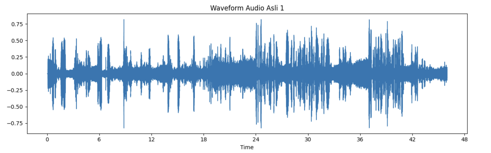
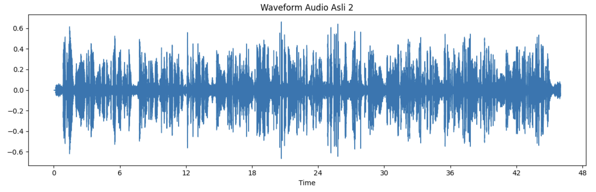
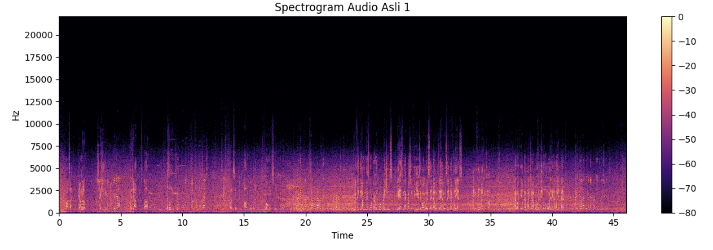
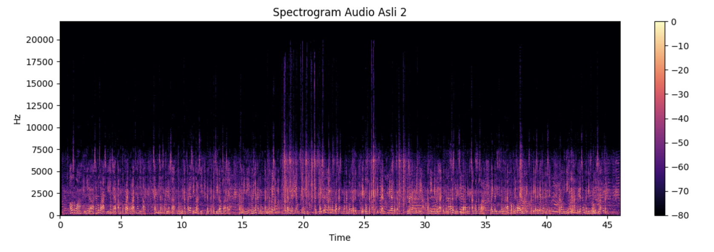
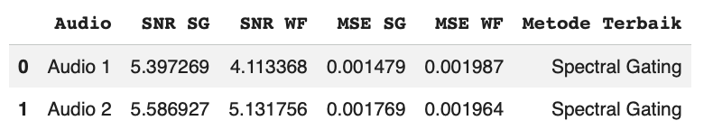

# Perbandingan Spectral Gating dan Wiener Filter dalam Penghilangan Noise pada Sinyal Suara

> **Perbandingan metode Spectral Gating dan Wiener Filter untuk penghilangan noise pada sinyal suara melalui analisis waveform, spectrogram, Signal-to-Noise Ratio (SNR), dan Mean Squared Error (MSE).**

---

## 📌 Project Overview

Proyek ini merupakan proyek akademik pada bidang **Pengolahan Sinyal Digital (Digital Signal Processing)** yang berfokus pada proses **penghilangan noise pada sinyal suara (audio denoising)** menggunakan dua pendekatan, yaitu **Spectral Gating** dan **Wiener Filter**.

Noise merupakan komponen yang tidak diinginkan dalam sinyal suara dan dapat memengaruhi kualitas audio. Oleh karena itu, diperlukan proses pengolahan sinyal untuk mengurangi noise dengan tetap mempertahankan karakteristik utama dari sinyal suara.

Pada proyek ini, sinyal suara diberikan tambahan noise kemudian diproses menggunakan dua metode denoising. Hasil dari kedua metode tersebut kemudian dibandingkan menggunakan analisis visual dan evaluasi kuantitatif.

Analisis dilakukan melalui:

- **Waveform** untuk melihat perubahan amplitudo sinyal terhadap waktu.
- **Spectrogram** untuk melihat distribusi komponen frekuensi terhadap waktu.
- **Signal-to-Noise Ratio (SNR)** untuk mengevaluasi rasio sinyal terhadap noise.
- **Mean Squared Error (MSE)** untuk mengukur perbedaan antara sinyal hasil denoising dan sinyal acuan.

Proyek ini tidak hanya berfokus pada penerapan metode, tetapi juga mencakup proses **data preparation, noise addition, parameter testing, denoising, quantitative evaluation, visual analysis, dan method comparison**.

---

## 🎯 Project Objectives

Tujuan utama dari proyek ini adalah:

1. Mempersiapkan dan melakukan preprocessing terhadap data sinyal suara.
2. Menambahkan noise pada sinyal suara sebagai bagian dari skenario eksperimen.
3. Menerapkan metode **Spectral Gating** untuk mengurangi noise pada sinyal suara.
4. Menerapkan metode **Wiener Filter** sebagai metode pembanding.
5. Menguji beberapa konfigurasi parameter pada masing-masing metode.
6. Mengevaluasi hasil denoising menggunakan **Signal-to-Noise Ratio (SNR)** dan **Mean Squared Error (MSE)**.
7. Membandingkan hasil kedua metode berdasarkan metrik evaluasi.
8. Menganalisis perubahan sinyal melalui **waveform** dan **spectrogram**.
9. Mendokumentasikan hasil eksperimen dalam bentuk notebook, audio output, visualisasi, dan file evaluasi.

---

## ❓ Problem Statement

Sinyal suara yang mengandung noise memiliki kualitas yang lebih rendah dibandingkan sinyal suara yang bersih. Berbagai metode dapat digunakan untuk mengurangi noise, tetapi setiap metode memiliki karakteristik dan hasil pengolahan yang berbeda.

Oleh karena itu, proyek ini melakukan eksperimen untuk membandingkan dua metode denoising, yaitu:

- **Spectral Gating**
- **Wiener Filter**

Perbandingan dilakukan pada sampel audio yang sama dengan kondisi eksperimen yang sama, kemudian hasilnya dianalisis menggunakan metrik **SNR** dan **MSE**, serta divisualisasikan menggunakan waveform dan spectrogram.

---

## 🔬 Methodology

Secara umum, alur eksperimen dalam proyek ini adalah:

```text
Clean Audio
     │
     ▼
Data Preparation
     │
     ▼
Noise Addition
     │
     ▼
Noisy Audio
     │
     ├─────────────────────────┐
     │                         │
     ▼                         ▼
Spectral Gating          Wiener Filter
     │                         │
     ▼                         ▼
Denoised Audio           Denoised Audio
     │                         │
     └────────────┬────────────┘
                  ▼
          Parameter Testing
                  │
                  ▼
          SNR & MSE Evaluation
                  │
                  ▼
           Method Comparison
                  │
                  ▼
       Waveform & Spectrogram
              Analysis
```

---

## 🧩 Experimental Workflow

### 1. Audio Preparation

Dua sampel audio digunakan sebagai sinyal suara yang akan diproses.

Sebelum digunakan dalam eksperimen, audio distandarkan dengan karakteristik:

| Attribute | Value |
|---|---|
| Number of clean audio samples | 2 |
| Sampling rate | 44,100 Hz |
| Duration | 46 seconds |
| Noise type | Wind noise |
| Noise mixing level | 0.3 |

Standardisasi dilakukan agar sampel audio dapat digunakan dalam kondisi eksperimen yang konsisten.

---

### 2. Noise Addition

Tahap berikutnya adalah menambahkan noise pada sinyal suara untuk menghasilkan **noisy audio**.

Noise yang digunakan dalam eksperimen merupakan **wind noise** dengan noise mixing level sebesar:

```text
0.3
```

Proses ini menghasilkan noisy audio yang kemudian digunakan sebagai input untuk kedua metode denoising.

Dengan demikian, kedua metode menerima kondisi input noisy audio yang sama sehingga hasilnya dapat dibandingkan berdasarkan eksperimen yang dilakukan.

---

### 3. Spectral Gating

**Spectral Gating** digunakan sebagai salah satu metode untuk mengurangi noise pada sinyal suara berdasarkan representasi spektralnya.

Pada eksperimen ini dilakukan pengujian terhadap beberapa parameter untuk melihat perubahan hasil denoising.

Parameter yang diuji adalah:

#### `prop_decrease`

```text
0.6
0.7
0.8
```

#### `time_mask_smooth_ms`

```text
20 ms
40 ms
```

Konfigurasi parameter diuji dan hasilnya dibandingkan berdasarkan nilai SNR yang diperoleh dalam eksperimen.

---

### 4. Wiener Filter

**Wiener Filter** digunakan sebagai metode kedua dalam eksperimen.

Beberapa ukuran kernel diuji untuk melihat pengaruh konfigurasi terhadap hasil pengolahan sinyal.

Kernel size yang diuji:

```text
3
5
7
9
```

Setiap konfigurasi kemudian dievaluasi menggunakan metrik yang sama dengan Spectral Gating.

---

### 5. Parameter Testing

Pengujian parameter dilakukan untuk mengetahui konfigurasi yang memberikan hasil eksperimen yang lebih baik berdasarkan nilai evaluasi.

Secara umum:

```text
Parameter Configuration
          │
          ▼
    Denoising Process
          │
          ▼
      SNR Evaluation
          │
          ▼
 Parameter Selection
```

Pemilihan konfigurasi dilakukan berdasarkan hasil SNR yang diperoleh pada sampel eksperimen.

> **Note:** Pemilihan parameter pada proyek ini merupakan bagian dari eksperimen pada sampel audio yang digunakan. Hasil tersebut tidak dimaksudkan sebagai klaim bahwa konfigurasi tertentu akan selalu menjadi konfigurasi terbaik pada seluruh jenis audio atau kondisi noise.

---

## ⚙️ Experimental Parameters

| Method | Parameter | Values Tested |
|---|---|---|
| Spectral Gating | `prop_decrease` | 0.6, 0.7, 0.8 |
| Spectral Gating | `time_mask_smooth_ms` | 20 ms, 40 ms |
| Wiener Filter | Kernel Size | 3, 5, 7, 9 |

---

## 📏 Evaluation Metrics

Dua metrik utama digunakan untuk mengevaluasi hasil denoising.

### Signal-to-Noise Ratio (SNR)

**Signal-to-Noise Ratio (SNR)** digunakan untuk melihat rasio antara sinyal yang diinginkan dengan noise.

Secara umum, nilai SNR yang lebih tinggi menunjukkan rasio sinyal terhadap noise yang lebih tinggi.

Dalam proyek ini, SNR digunakan sebagai salah satu dasar dalam membandingkan hasil dari Spectral Gating dan Wiener Filter.

---

### Mean Squared Error (MSE)

**Mean Squared Error (MSE)** digunakan untuk mengukur rata-rata kuadrat perbedaan antara sinyal hasil pengolahan dan sinyal acuan.

Secara umum, nilai MSE yang lebih rendah menunjukkan perbedaan yang lebih kecil terhadap sinyal acuan.

MSE digunakan sebagai metrik tambahan untuk melengkapi evaluasi berbasis SNR.

---

## 📊 Experimental Results

Hasil evaluasi dari dua sampel audio yang digunakan dalam eksperimen adalah:

| Audio | Method | SNR (dB) | MSE |
|---|---|---:|---:|
| Audio 1 | Spectral Gating | 5.397269 | 0.001479 |
| Audio 1 | Wiener Filter | 4.113368 | 0.001987 |
| Audio 2 | Spectral Gating | 5.586927 | 0.001769 |
| Audio 2 | Wiener Filter | 5.131756 | 0.001964 |

---

### 🎧 Audio 1

| Metric | Spectral Gating | Wiener Filter |
|---|---:|---:|
| SNR | **5.397269 dB** | 4.113368 dB |
| MSE | **0.001479** | 0.001987 |

Berdasarkan hasil eksperimen pada Audio 1:

- Spectral Gating menghasilkan SNR sebesar **5.397269 dB**.
- Wiener Filter menghasilkan SNR sebesar **4.113368 dB**.
- Spectral Gating menghasilkan MSE sebesar **0.001479**.
- Wiener Filter menghasilkan MSE sebesar **0.001987**.

---

### 🎧 Audio 2

| Metric | Spectral Gating | Wiener Filter |
|---|---:|---:|
| SNR | **5.586927 dB** | 5.131756 dB |
| MSE | **0.001769** | 0.001964 |

Berdasarkan hasil eksperimen pada Audio 2:

- Spectral Gating menghasilkan SNR sebesar **5.586927 dB**.
- Wiener Filter menghasilkan SNR sebesar **5.131756 dB**.
- Spectral Gating menghasilkan MSE sebesar **0.001769**.
- Wiener Filter menghasilkan MSE sebesar **0.001964**.

---

## 🔎 Experimental Observation

Berdasarkan hasil pengujian pada dua sampel audio:

- Spectral Gating menghasilkan nilai **SNR yang lebih tinggi** dibandingkan Wiener Filter pada kedua sampel.
- Spectral Gating menghasilkan nilai **MSE yang lebih rendah** dibandingkan Wiener Filter pada kedua sampel.
- Pada tabel evaluasi proyek, Spectral Gating tercatat sebagai metode yang dipilih untuk kedua sampel berdasarkan hasil eksperimen.

Hasil tersebut merupakan hasil yang diperoleh pada **sampel audio dan kondisi eksperimen yang digunakan dalam proyek ini**.

Oleh karena itu, hasil eksperimen tidak dimaksudkan untuk menyatakan bahwa Spectral Gating akan selalu menghasilkan performa yang lebih baik dibandingkan Wiener Filter pada seluruh jenis sinyal suara, jenis noise, atau kondisi parameter.

---

## 📈 Visual Analysis

Selain evaluasi numerik, hasil denoising dianalisis secara visual menggunakan **waveform** dan **spectrogram**.

---

### 🌊 Waveform Comparison

Waveform digunakan untuk melihat perubahan amplitudo sinyal terhadap waktu.

Perbandingan dilakukan antara:

- Original audio
- Noisy audio
- Spectral Gating
- Wiener Filter

#### Audio 1



#### Audio 2



Visualisasi waveform digunakan untuk melihat perubahan bentuk dan amplitudo sinyal setelah proses penambahan noise dan denoising.

---

### 🎼 Spectrogram Comparison

Spectrogram digunakan untuk merepresentasikan distribusi energi frekuensi terhadap waktu.

Perbandingan dilakukan antara:

- Original audio
- Noisy audio
- Spectral Gating
- Wiener Filter

#### Audio 1



#### Audio 2



Visualisasi spectrogram digunakan untuk mengamati perubahan karakteristik spektral sinyal setelah proses denoising.

---

### 📊 Evaluation Visualization

Ringkasan hasil evaluasi juga tersedia dalam bentuk visualisasi.



Visualisasi tersebut merangkum hasil evaluasi berdasarkan:

- **Signal-to-Noise Ratio (SNR)**
- **Mean Squared Error (MSE)**

Hasil numerik lengkap dapat ditemukan pada:

[`results/Evaluasi_Denoising-2.xlsx`](./results/Evaluasi_Denoising-2.xlsx)

---

## 🔊 Audio Outputs

Repository menyediakan beberapa audio output hasil eksperimen pada folder [`audio/`](./audio/).

| File | Description |
|---|---|
| `audio_noisy1.wav` | Noisy version of Audio 1 |
| `audio_noisy2.wav` | Noisy version of Audio 2 |
| `audio_sg1.wav` | Audio 1 processed using Spectral Gating |
| `audio_sg2.wav` | Audio 2 processed using Spectral Gating |
| `audio_wiener1.wav` | Audio 1 processed using Wiener Filter |
| `audio_wiener2.wav` | Audio 2 processed using Wiener Filter |

Output tersebut memungkinkan hasil pengolahan untuk dibandingkan tidak hanya secara visual dan numerik, tetapi juga secara langsung melalui audio.

> Beberapa file audio sumber asli tidak disertakan dalam repository karena pertimbangan ukuran file dan kebutuhan penyusunan repository portfolio.

---

## 📂 Dataset & Data Availability

Data yang digunakan dalam eksperimen terdiri dari:

- Dua clean audio samples.
- Satu noise sample berupa wind noise.
- Noisy audio hasil pencampuran clean audio dan noise.

Karakteristik utama data:

| Attribute | Description |
|---|---|
| Clean audio samples | 2 |
| Noise sample | Wind noise |
| Sampling rate | 44,100 Hz |
| Audio duration | 46 seconds |
| Noise mixing level | 0.3 |

Tidak seluruh source audio asli disertakan dalam repository karena pertimbangan ukuran file.

Informasi lebih lanjut mengenai data tersedia pada:

[`data/README.md`](./data/README.md)

---

## 📁 Repository Structure

```text
perbandingan-spectral-gating-wiener-filter/
│
├── README.md
│
├── notebooks/
│   └── KODE_PSD_KEL_10.ipynb
│
├── data/
│   └── README.md
│
├── audio/
│   ├── README.md
│   ├── audio_noisy1.wav
│   ├── audio_noisy2.wav
│   ├── audio_sg1.wav
│   ├── audio_sg2.wav
│   ├── audio_wiener1.wav
│   └── audio_wiener2.wav
│
├── results/
│   ├── README.md
│   └── Evaluasi_Denoising-2.xlsx
│
└── screenshots/
    ├── README.md
    ├── waveform_comparison_audio1.png
    ├── waveform_comparison_audio2.png
    ├── spectrogram_comparison_audio1.png
    ├── spectrogram_comparison_audio2.png
    └── evaluation_results.png
```

---

## 📋 Repository Components

### `notebooks/`

Berisi notebook utama yang digunakan untuk implementasi dan eksperimen.

**File:**

[`KODE_PSD_KEL_10.ipynb`](./notebooks/KODE_PSD_KEL_10.ipynb)

Notebook mencakup proses utama pengolahan sinyal dan evaluasi eksperimen.

---

### `data/`

Berisi dokumentasi mengenai data yang digunakan dalam proyek, karakteristik audio, serta alur preprocessing.

**File:**

[`data/README.md`](./data/README.md)

---

### `audio/`

Berisi selected audio outputs dari eksperimen.

Output mencakup:

- Noisy audio
- Spectral Gating output
- Wiener Filter output

**Folder:**

[`audio/`](./audio/)

---

### `results/`

Berisi hasil evaluasi numerik dari eksperimen.

**File utama:**

[`Evaluasi_Denoising-2.xlsx`](./results/Evaluasi_Denoising-2.xlsx)

File tersebut berisi nilai SNR dan MSE yang digunakan dalam perbandingan kedua metode.

---

### `screenshots/`

Berisi visualisasi hasil eksperimen yang dipilih untuk dokumentasi portfolio.

Visualisasi mencakup:

- Waveform comparison Audio 1
- Waveform comparison Audio 2
- Spectrogram comparison Audio 1
- Spectrogram comparison Audio 2
- Evaluation results

**Folder:**

[`screenshots/`](./screenshots/)

---

## 💻 Tools & Technologies

### Programming & Environment

- **Python**
- **Jupyter Notebook**

### Domain

- **Digital Signal Processing**
- **Audio Signal Processing**
- **Audio Denoising**

### Methods

- **Spectral Gating**
- **Wiener Filter**

### Evaluation

- **Signal-to-Noise Ratio (SNR)**
- **Mean Squared Error (MSE)**

### Analysis & Visualization

- Waveform Analysis
- Spectrogram Analysis
- Quantitative Comparison

---

## 🧠 Skills Demonstrated

Melalui proyek ini, beberapa kemampuan yang diterapkan meliputi:

### Data & Signal Processing

- Audio data preparation
- Signal preprocessing
- Noise generation
- Audio denoising
- Digital signal processing

### Analytical Skills

- Parameter experimentation
- Quantitative evaluation
- Metric comparison
- Result interpretation
- Experimental analysis

### Visualization

- Waveform visualization
- Spectrogram visualization
- Comparative analysis

### Documentation

- Experiment documentation
- Result organization
- Portfolio-oriented project structuring

---

## 🚀 How to Run

### 1. Clone Repository

```bash
git clone https://github.com/annisa-ramadhni/perbandingan-spectral-gating-wiener-filter.git
```

### 2. Navigate to Project Directory

```bash
cd perbandingan-spectral-gating-wiener-filter
```

### 3. Open the Notebook

Buka notebook utama:

```text
notebooks/KODE_PSD_KEL_10.ipynb
```

Notebook dapat dibuka menggunakan **Jupyter Notebook** atau **JupyterLab**.

### 4. Run the Notebook

Jalankan cell pada notebook secara berurutan untuk mengikuti alur eksperimen:

1. Data preparation
2. Audio preprocessing
3. Noise addition
4. Spectral Gating
5. Wiener Filter
6. Parameter testing
7. SNR evaluation
8. MSE evaluation
9. Method comparison
10. Waveform visualization
11. Spectrogram visualization

> **Reproducibility Note:** Repository ini disusun sebagai versi portfolio dari proyek akademik. Tidak seluruh file audio sumber yang digunakan dalam eksperimen asli disertakan karena pertimbangan ukuran file. Oleh karena itu, notebook merupakan sumber utama untuk memahami implementasi dan alur eksperimen, sedangkan folder `audio/`, `results/`, dan `screenshots/` menyediakan output dan dokumentasi hasil yang dipilih.

---

## 📌 Project Limitations

Proyek ini memiliki beberapa keterbatasan:

1. Eksperimen menggunakan **dua sampel audio**, sehingga hasil belum dapat dianggap mewakili seluruh karakteristik sinyal suara.
2. Noise yang digunakan merupakan **wind noise**, sehingga performa kedua metode terhadap jenis noise lain belum dievaluasi.
3. Parameter yang diuji berada pada rentang konfigurasi yang telah ditentukan dalam eksperimen.
4. Pemilihan parameter dilakukan berdasarkan hasil SNR pada sampel eksperimen yang digunakan.
5. Tidak seluruh source audio disertakan dalam repository karena pertimbangan ukuran file.
6. Hasil yang diperoleh menggambarkan kondisi eksperimen pada data, noise, dan parameter yang digunakan dalam proyek ini.
7. Hasil eksperimen tidak dimaksudkan sebagai generalisasi bahwa salah satu metode akan selalu lebih baik untuk seluruh kondisi audio.

---

## 📚 Main Notebook

Implementasi utama tersedia pada:

**[`KODE_PSD_KEL_10.ipynb`](./notebooks/KODE_PSD_KEL_10.ipynb)**

Notebook tersebut menjadi sumber utama untuk melihat:

- Persiapan data
- Preprocessing
- Noise addition
- Spectral Gating
- Wiener Filter
- Parameter testing
- SNR evaluation
- MSE evaluation
- Waveform analysis
- Spectrogram analysis

---

## 📊 Result Files

Hasil evaluasi numerik tersedia pada:

**[`Evaluasi_Denoising-2.xlsx`](./results/Evaluasi_Denoising-2.xlsx)**

File tersebut berisi hasil pengukuran SNR dan MSE dari kedua metode pada dua sampel audio.

---

## 🎓 Project Context

| Information | Details |
|---|---|
| **Project Type** | Academic Project |
| **Course / Field** | Digital Signal Processing |
| **Domain** | Audio Signal Processing |
| **Project Focus** | Audio Denoising |
| **Methods Compared** | Spectral Gating & Wiener Filter |
| **Audio Samples** | 2 |
| **Noise Type** | Wind Noise |
| **Sampling Rate** | 44,100 Hz |
| **Duration** | 46 seconds |
| **Noise Mixing Level** | 0.3 |
| **Evaluation Metrics** | SNR & MSE |
| **Visualization** | Waveform & Spectrogram |
| **Primary Implementation** | Python / Jupyter Notebook |

---

## 🗂️ Project Deliverables

Repository ini menyediakan beberapa komponen hasil proyek:

| Deliverable | Location |
|---|---|
| Main implementation | [`notebooks/KODE_PSD_KEL_10.ipynb`](./notebooks/KODE_PSD_KEL_10.ipynb) |
| Data documentation | [`data/README.md`](./data/README.md) |
| Audio outputs | [`audio/`](./audio/) |
| Evaluation results | [`results/Evaluasi_Denoising-2.xlsx`](./results/Evaluasi_Denoising-2.xlsx) |
| Result visualizations | [`screenshots/`](./screenshots/) |
| Project documentation | [`README.md`](./README.md) |

---

## 👩‍💻 Author

### Annisa Ramadhani

**Data Science Student**

[](https://github.com/annisa-ramadhni)

**GitHub:**  
https://github.com/annisa-ramadhni

**Project Repository:**  
https://github.com/annisa-ramadhni/perbandingan-spectral-gating-wiener-filter

---

## ⭐ About This Project

Proyek ini merupakan bagian dari portofolio akademik yang menunjukkan penerapan konsep **Digital Signal Processing** dalam pengolahan sinyal suara.

Proses yang dilakukan dalam proyek ini mencakup keseluruhan alur eksperimen, mulai dari persiapan data, penambahan noise, penerapan metode denoising, pengujian parameter, evaluasi kuantitatif, hingga analisis visual.

Secara khusus, proyek ini menunjukkan penerapan:

- **Data Preparation**
- **Audio Preprocessing**
- **Noise Addition**
- **Digital Signal Processing**
- **Spectral Gating**
- **Wiener Filtering**
- **Parameter Experimentation**
- **Signal Evaluation**
- **SNR Analysis**
- **MSE Analysis**
- **Waveform Analysis**
- **Spectrogram Analysis**
- **Comparative Analysis**

Repository ini disusun sebagai dokumentasi proyek sekaligus bagian dari **portfolio Data Science**, khususnya untuk menunjukkan pengalaman dalam melakukan eksperimen berbasis data, pengolahan sinyal, evaluasi kuantitatif, visualisasi, dan interpretasi hasil menggunakan Python.

---

## 📎 Repository Links

- **Main Repository:** [perbandingan-spectral-gating-wiener-filter](https://github.com/annisa-ramadhni/perbandingan-spectral-gating-wiener-filter)
- **Main Notebook:** [KODE_PSD_KEL_10.ipynb](./notebooks/KODE_PSD_KEL_10.ipynb)
- **Data Documentation:** [data/README.md](./data/README.md)
- **Audio Outputs:** [audio/](./audio/)
- **Evaluation Results:** [results/](./results/)
- **Screenshots:** [screenshots/](./screenshots/)

---

## 📄 License

This repository contains an academic project developed for educational and portfolio purposes.
